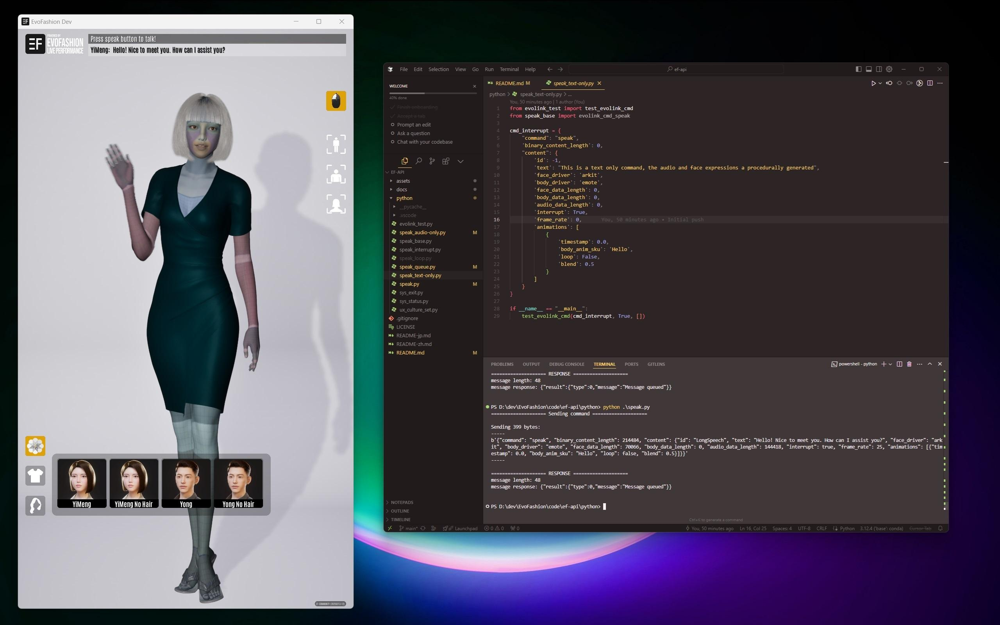

# EF Community Build

本リポジトリは、3D 対話型 AI アプリケーションの事前コンパイル済み開発ビルドです。  
高品質なデモンストレーションと、堅牢な開発テスト環境を提供します。

## 開発を始める
開発者の皆様は、本ビルドの機能を拡張したり、組み込まれている AI モジュール（例：ASR、TTS、LLM）を別のものに置き換えたりすることが可能です。  
詳しくは、当社のオープン API プロジェクト [ef-api](https://github.com/evovor/ef-api) をご覧ください。

## OS サポート
本ビルドには、Windows および Linux 用のビルドが含まれています。  
現在、**Windows 11** と **Ubuntu 22.04** でテスト済みです。  
その他の互換性のある OS でも動作する可能性はありますが、現時点では未検証となります。

**ライセンス**  
このソフトウェアは **CC BY-NC** ライセンスのもとで提供されています。  
開発・デモンストレーション目的であれば無料でご利用いただけます。  
商用利用をご検討の場合は、ライセンスオプションについてお問い合わせください。

**スクリーンショット**  
  

---

EF Community Version への貢献を歓迎いたします。Issue や Pull Request をお寄せいただくことで、対話型 AI ソリューションをさらに改善・進化させることができます。  
また、3D デジタルヒューマンに関する幅広いディスカッションやコラボレーションをお考えの方は、新設された [Digital Human Hub](https://digitalhumanhub.org/) フォーラムもぜひご覧ください。
