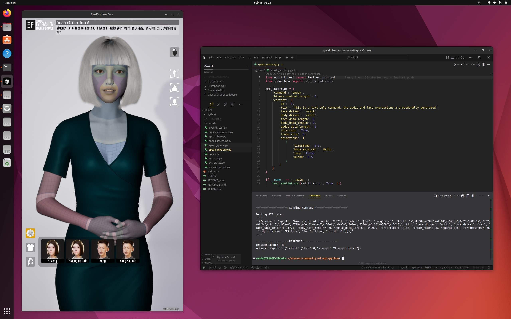
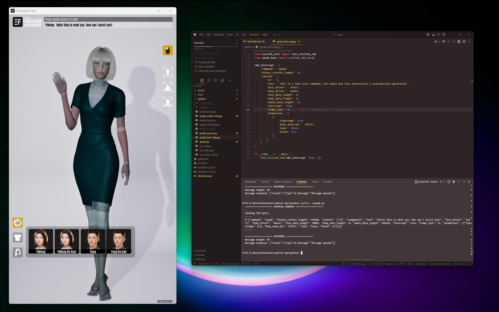

# EF Community Build

此版本为我们 3D 对话式 AI 应用程序的预编译开发构建，能够为开发工作提供高质量的演示效果和稳定的测试环境。

## 开始您的开发
开发者可在此构建的基础上扩展其功能，或将内置的 AI 模块（如 ASR、TTS、LLM）替换为其他方案。  
如需更多信息，请访问我们的开放 API 项目：[ef-api](https://github.com/evovor/ef-api)。

## 操作系统支持
该构建包含适用于 Windows 和 Linux 的版本，已在 **Windows 11** 与 **Ubuntu 22.04** 上通过测试。  
其他兼容操作系统也有可能正常运行，但尚未经过验证。

**许可证**  
本软件在 **CC BY-NC** 许可证下发布，允许免费用于**开发**和**演示**。  
若需商业用途，请与我们联系以了解相关授权方案。

**截图**  
  

---

欢迎为 EF Community Version 提交 Issue 或 Pull Request，以帮助我们进一步完善并提升对话式 AI 的整体体验。  
如果您想要更广泛地讨论或与他人合作 3D 数字人相关项目，欢迎加入全新的 [Digital Human Hub](https://digitalhumanhub.org/) 论坛。  